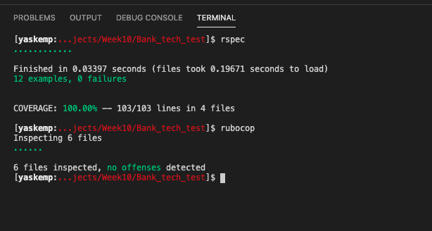
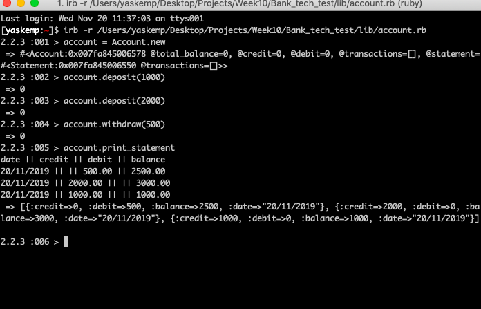

# Bank tech test

## Specification

### Requirements

* You should be able to interact with your code via a REPL 
* Deposits, withdrawal
* Account statement (date, amount, balance) printing
* Data can be kept in memory (as opposed to a database)

### Acceptance criteria

**Given** a client makes a deposit of 1000 on 10-01-2012  
**And** a deposit of 2000 on 13-01-2012  
**And** a withdrawal of 500 on 14-01-2012  
**When** she prints her bank statement  
**Then** she would see

```
date || credit || debit || balance
14/01/2012 || || 500.00 || 2500.00
13/01/2012 || 2000.00 || || 3000.00
10/01/2012 || 1000.00 || || 1000.00
```

# Installation

download the repo into your Projects folder using:

```
git clone ghttps://github.com/Yasmineral/Bank_tech_test.git
```

change into the banking directory, then run:

```
bundle install
```

to install dependencies.

# Testing

Within the project folder, run tests & view test coverage with the following command:

```rspec```


I used Rubocop to anaylse code style and Simplecov to asses code coverage. Tests are currently all passing with coverage at 100% and zero offense listed.





# User stories

```
As a customer, 
so that I can be a responsible adult, 
I'd like to be able to open a bank account.
```

```
As a customer, 
so that I can keep my money safe,
I'd like to deposit money into my bank account.
```

```
As a customer,
so that I can access my money when I need it,
I'd like to withdraw from my account.
```

```
As a customer,
so that I know how much money is in my account,
I'd like to see my total balance.
```

```
As a customer, 
so that I can manage my cash flow,
I'd like to see a dated statment of all deposit & withdrawls.
```


# Process

I began drawing out my domain model, identifying nouns and verbs of my program. I decided to put most of the functionality into the Account class and begin the TDD process until I saw a good opportunity to refactor and extract classes. 
I wanted a way of recording account activity as soon as a deposit or withdrawal had been made and recording whether the user had credited or debited their account. I added a credit & debit instance variable which got updated according to which method was called and this information was pushed to the Transaction class as a hash. With more time, I would have refactored this functionality into a Transaction class and delegated all credit / debit differentiation & storage here. This would also clean up my Statement class, which is currently doing too many things and therefore not adhering to Single Responsibility principles. Currently, the class is responsible for iterating through the array and printing the information in a user friendly way. Other future additions include implementing a guard clause against adding or withdrawing negative numbers.

# Running program




